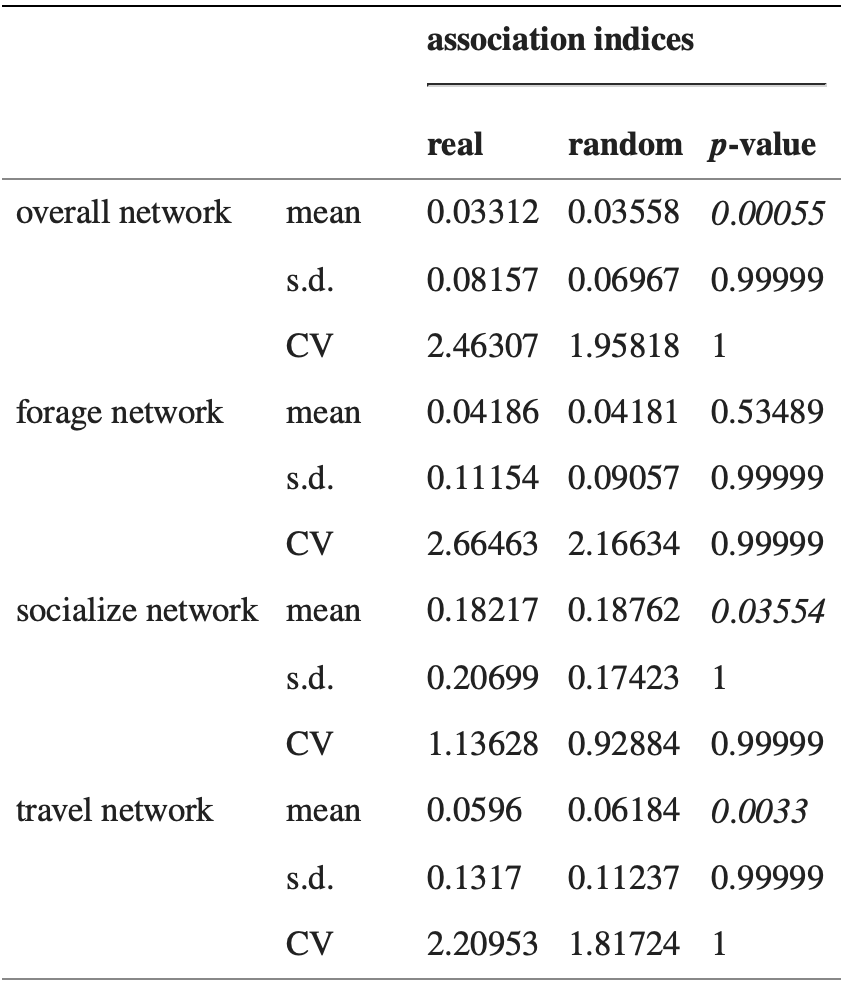
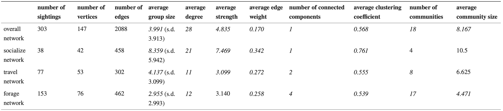
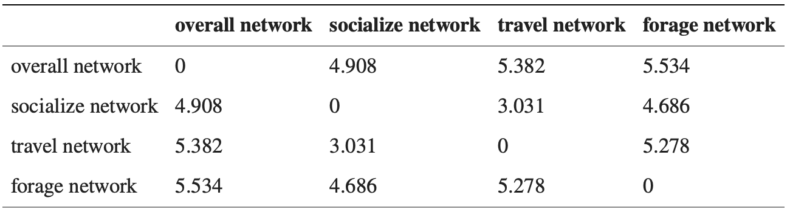

In our case the weight would be -> weighted, with the weights being the half-weight index (HWI)=the number of times dolphins A and B were seen together divided 
by the total number of times they were seen together plus half the value of when A was seen without B and B was seen without A, and range from 0 for individuals
 that were never sighted together in groups to 1 for individuals that were always sighted together

# Introduction.
Our network analysis project is based on the research article "The importance of delineating networks by activity type in bottlenose dolphins in Cedar Key, Florida" (Gazda et al, 2015). The goal of this paper was to demonstrate the existence of a fission-fusion structure within these animals. 

# Fission-Fusion social structure.
The fission-fusion social structure is a pattern where the size and composition of animal groups change frequently and rapidly. Individuals split (fission) and merge (fusion) into groups of varying sizes and compositions based on factors like resource availability, predator presence, and social or reproductive needs.
In this case, three main behavioral contexts were analysed: socializing, travelling, foraging.
The null hypothesis is that regardless of activity state, the corresponding networks will be similar to each other and to the overall network that does not take activity into account.

# Paper's Key findings.
The study's findings reveal that dolphins socialize in large groups with preferential associations, travel in smaller groups with selective partners, and forage in very small, weakly connected groups. There is some overlap between socializing and traveling networks but little overlap with foraging networks, indicating that social bonds are less important during foraging.

# Data collection
Data were collected from 147 resident bottlenose dolphins in Cedar Key, Florida, over two periods in 2008 and 2010. Dolphins were observed for socializing, traveling, and foraging behaviors. Individual dolphins were identified using photographs of their dorsal fins. Group compositions were recorded, excluding sightings of the same group within an hour or on the same day to avoid non-independent sampling.

# Network Construction
In this context, the vertices in the network represent the individual dolphins, and the edges represent associations between the corresponding dolphins.

*Four main networks* were used: an overall network that does not take behavior into account, and the socialize network, the travel network and the forage network that correspond to their respective behaviors. In addition, a comprehensive network was created as well, combining all the other four together.

Each network was simple, undirected, and weighted, with edge weights calculated using the half-weight index (HWI): the number of times dolphins A and B were seen together divided by the total number of times they were seen together plus half the value of when A was seen without B and B was seen without A, and range from 0 for individuals that were never sighted together in groups to 1 for individuals that were always sighted together. This method gives different weights to associations based on their strength, helping to filter out weak associations and reducing sampling bias.

Networks were pruned by removing dolphins sighted fewer than three times to ensure significant patterns of association.

# Project Objective
Our project aims to visualize the findings from the paper using the most appropriate graphs. We will employ network analysis tools to graphically represent the different behavioral networks (socializing, traveling, foraging) of the Cedar Key dolphins.

Additionally, we will propose new perspectives beyond those presented in the paper and graphically represent these insights as well.    QUESTO INVECE QUANDO FAI  summary(overall_dolphins_label)
* Summary explanation:
  + V1 and V2: there are 291 vertices. The 147 (x2 = 294) dolphins of interest were recorded in two distinct periods, and were recorded in the dataset as two different dolphins. The 3 remaining points were caused by the absence of at least three sightings of 3 dolphins.
  + Type: categorical variable explaining the type of activity (Social, Travel, Forage) the two dolphins were performing at the moment of the sighting. The fourth type, "O", refers to an edge where the activity that was being performed was not of interest at the moment of the sighting. It allows to test the null hypothesis: there is no difference in the networks for specific activities and the overall network, where activity was not of interest.
  + Sightings: amount of times that two dolphins were seen together. It helps assessing the weight of the edge.


```{r libraries}
library(graphlayouts)
library(ggforce)
library(gridExtra)
library(dplyr)
# install.packages("seriation",repos = "http://cran.us.r-project.org")
library(seriation)
library(tidygraph)
library(ggplot2)
library(igraph)
library(tidyverse)
library(ggraph)
library(ggrepel)
library(ggridges)
library(networkdata)
library(knitr)
library(extrafont)
library(multiplex)
library(kableExtra)
loadfonts(device = "pdf")
```

```{r setup_import_dataset}

# Import the data
# Overall dolphin social network
net_overall <- read_graph("Data/all.gml", format = "gml")
# Forage dolphins social network
net_forage <- read_graph("Data/forage.gml", format = "gml")
# Social dolphins social network
net_social <- read_graph("Data/socialise.gml", format = "gml")
# Travel dolphins social network
net_travel <- read_graph("Data/travel.gml", format = "gml")
```
# General networks information
```{r}
# General information about the networks
# Create a list of network objects
networks <- list(Forage = net_forage,Travel= net_travel,Social = net_social, Overall= net_overall)

info_networks <- lapply(networks, function(net) {
  data.frame(
    Order = vcount(net),
    Size = ecount(net),
    Diameter = diameter(net),
    Is_Connected_Weak = is_connected(net, mode = "weak"),
    Is_Connected_Strong = is_connected(net, mode = "strong")
  )
})
names(info_networks) <- names(networks)

```

# Network visualization
```{r vis_general}
# Suggested colors for edge categories and node gradient
node_gradient <- c("#f7fbff", "#08306b")  # From light blue to dark blue
threshold =  max(V(net_social)$sightings - 2*sd(V(net_social)$sightings))

# Plot the network per spiegare sightings e hwi
# PENSARE SE METTERE DEGREE SU SIZE
ggraph(net_social, layout = "centrality", cent = graph.strength(net_social)) +
  geom_edge_link2(aes(edge_linewidth = hwi), edge_colour = "grey") +
  geom_node_point(aes(fill = V(net_social)$degree, size = sightings), shape=21) +
  scale_fill_gradient(low = node_gradient[1], high = node_gradient[2]) + 
  geom_node_text(aes(label = id, filter = sightings >= threshold), vjust = 0.5, hjust = 0.5,
                 family = "serif", size = 3, col = "black") +  # Adjust font size as needed
  scale_size(range = c(4, 10), guide = "none") +
  coord_fixed() +
  theme(legend.position = "bottom")
```

```{r vis_matrix}

library(ggplot2)
library(igraph)

# Create a list to store the heatmaps
heatmaps <- list()

# Loop through each network and create the heatmap
for (i in 1:length(networks)) {
  adj_matrix <- as.matrix(as_adjacency_matrix(networks[[i]], attr = "hwi", sparse = FALSE))
  adj_df <- as.data.frame(as.table(adj_matrix))
  names(adj_df) <- c("Dolphin_1", "Dolphin_2", "HWI")
  
  heatmap <- ggplot(adj_df, aes(x = Dolphin_1, y = Dolphin_2, fill = HWI)) +
    geom_tile() +
    scale_fill_gradient(low = "white", high = "red") +
    coord_fixed() +
    theme_minimal() +
    ggtitle(names(networks)[i]) +
    theme(axis.text.x = element_text(angle = 90, hjust = 1)) + 
    labs(title = paste("Heatmap of", names(networks)[i]))
  
  heatmaps[[i]] <- heatmap
}

# Grid the heatmaps 2x2
grid.arrange(heatmaps[[1]], heatmaps[[2]], heatmaps[[3]], heatmaps[[4]], ncol = 2)

```

# Research Findings + Graphical Representation

Here we report the research study findings, we explain what does it mean in terms of graph construction and then proceed to propose the approprate graphs.
```{r table_2_3}


```

* There are preferential associations between individuals in the overall network, the socialize network and the travel network, but not in the forage network (table 2). This is not an artefact of sample size: the number of sightings in the forage network (153) is greater than that in the travel network (77) and socialize network (38).
  + Node degree distribution plots helps to visualize preferential associations. Nodes with higher degrees have more connections, indicating preferential associations. 
  
Social Network: Lower degree distribution in the social network indicates that dolphins in this network have fewer connections or associations compared to the forage network.

Forage Network: Higher degree distribution in the forage network suggests that dolphins in this network have more connections or associations compared to the social network.

## Degree


```{r degree_distribution}

general_graph = function(title, metric_S, metric_F, metric_T,metric_O, breaks=100){

  netstat_dist <- function (s, breaks) { # statistic s could be anything
    h <- hist(s, plot = FALSE, breaks)
    bin_breaks <- as.vector(stats::filter(h$breaks, c(1, 1) / 2))
    bin_breaks <- bin_breaks[-length(h$breaks)]
    list(d = bin_breaks[h$counts > 0], fd = h$counts[h$counts > 0])
  }

  dd_S <- netstat_dist(metric_S, breaks = breaks)
  dd_F <- netstat_dist(metric_F, breaks = breaks)
  dd_T <- netstat_dist(metric_T, breaks = breaks)
  dd_O <- netstat_dist(metric_O, breaks = breaks)
  # Plot degree distribution
  # Combine degree distribution data into a single data frame
  data_degree_dist <- data.frame(Network = c(rep("Social Network", length(dd_S$d)),
                    rep("Forage Network", length(dd_F$d)),
                    rep("Travel Network", length(dd_T$d)),
                    rep("Overall Network", length(dd_O$d))),

              Degree = c(dd_S$d, dd_F$d, dd_T$d, dd_O$d),
              Frequency = c(dd_S$fd, dd_F$fd, dd_T$fd, dd_O$fd))


  # Define the plots
  # Degree Histogram with KDE
  degree_hist_kde <- ggplot(data_degree_dist, aes(x = Degree, fill = Network)) +
    geom_histogram(binwidth = 1, alpha = 0.5, position = "identity") +
    geom_density(alpha = 0.5) +
    labs(title = paste(title, "Distribution with KDE"),
        x = title,
        y = "Frequency") +
    theme_minimal()

  # Cumulative Degree Distribution Plot
  degree_cumulative <- ggplot(data_degree_dist, aes(x = Degree, group = Network, color = Network)) +
    stat_ecdf(size = 1) +
    labs(title = paste("Cumulative", title," Distribution"),
        x = title,
        y = "Cumulative Frequency") +
    theme_minimal()

  # Violin Plot of Degree Distribution
  degree_violin <- ggplot(data_degree_dist, aes(x = Network, y = Degree, fill = Network)) +
    geom_violin() +
    labs(title = paste("Violin Plot of ",title," Distribution"),
        x = "Network",
        y = title) +
    theme_minimal()

  # Ridgeline Plot of Degree Distribution
  degree_ridgeline <- ggplot(data_degree_dist, aes(x = Degree, y = Network, fill = Network)) +
    geom_density_ridges(scale = 2, rel_min_height = 0.01) +
    labs(title = paste("Ridgeline Plot of ", title, " Distr."),
        x = title,
        y = "Network") +
    theme_minimal() +
    theme(legend.position = "none")

  # Arrange plots in a grid
  grid_1 = grid.arrange(degree_hist_kde, degree_cumulative, degree_violin, degree_ridgeline, nrow = 2)

  # Plot degree distribution
  # Fit GLM for each network type
  glm_models <- lapply(split(data_degree_dist, data_degree_dist$Network), function(df) {
    glm(Frequency ~ log(Degree), family = poisson, data = df)
  })

  # Plot degree distribution using ggplot
  degree_distribution_plot = ggplot(data_degree_dist, aes(x = log(Degree), y = Frequency, color = Network)) +
    geom_point() +
    geom_smooth(method = "glm", method.args = list(family = poisson), se = FALSE) +
    labs(title = paste(title, " Distribution"),
      x = paste("log(",title,")"),
      y = "Frequency") +
    theme_minimal()

  degree_summary <- sapply(networks, function(net) {
    degree_values <- degree(net)
    c(Mean = mean(degree_values), Median = median(degree_values), Max = max(degree_values))
  })

  degree_summary <- t(degree_summary)
  degree_summary <- as.data.frame(degree_summary)
  degree_summary$Network <- rownames(degree_summary)
  degree_summary <- degree_summary[, c("Network", "Mean", "Median", "Max")]

  # Convert the summary table to a ggplot table
  summary_table <- tableGrob(degree_summary, rows = NULL)

  grid_2 = grid.arrange(degree_distribution_plot, summary_table, nrow = 2, heights = c(3, 1))


  avgs = c(mean(metric_S), mean(metric_F), mean(metric_T), mean(metric_O))

  bar_plot = function(avgs, title) {
    data <- data.frame(Network = c("Social Network", "Forage Network", "Travel Network", "Overall Network"),
                      Avg = avgs)
    
    plot = ggplot(data, aes(x = Network, y = Avg, fill = Network)) +
      geom_col() +
      geom_text(aes(label = round(Avg, 2)), vjust = -0.5) +
      labs(title = paste("Average", title, "Comparison"),
          x = "Network",
          y = "Average") +
      theme_minimal()
    return(plot)
  }
  grid_3 = bar_plot(avgs, title)

  return(list(grid_1, grid_2,grid_3, avgs))
}

degree_plots = general_graph("Degree", V(net_social)$degree, V(net_forage)$degree, V(net_travel)$degree, V(net_overall)$degree)
```


## Strength


```{r strength_distribution}

strength_plots =general_graph("Strength", V(net_social)$strength, V(net_forage)$strength, V(net_travel)$strength, V(net_overall)$strength)
strength_plots[[4]]
```

## Clustering Coefficient

```{r clustering_coefficient}

clustering_plots = general_graph("Clustering Coefficient", V(net_social)$clustering, V(net_forage)$clustering, V(net_travel)$clustering, V(net_overall)$clustering)
clustering_plots[[4]] = sapply(networks, function(net){transitivity(net)})
```

## Betweenness Centrality

```{r betweenness_centrality}

betweenness_plots = general_graph("Betweenness Centrality", V(net_social)$betweenness, V(net_forage)$betweenness, V(net_travel)$betweenness, V(net_overall)$betweenness)
```

## Closeness Centrality

```{r closeness_centrality}

closeness_plots = general_graph("Closeness Centrality", V(net_social)$closeness, V(net_forage)$closeness, V(net_travel)$closeness, V(net_overall)$closeness)

```

## Eigenvector Centrality

```{r eigenvector_centrality}

eigenvector_plots = general_graph("Eigenvector Centrality", V(net_social)$eigenvector, V(net_forage)$eigenvector, V(net_travel)$eigenvector, V(net_overall)$eigenvector)

```

## Community

```{r community}

community_plots = general_graph("Community", V(net_social)$community, V(net_forage)$community, V(net_travel)$community, V(net_overall)$community)
community_plots[[4]] = sapply(networks, function(network)({length(unique(V(network)$community))}))

```

## Summary
```{r summary_metrics}
data_summary <- data.frame(
  Category = c("Social Network", "Forage Network", "Travel Network", "Overall Network"),
  degree = as.integer(degree_plots[[4]]),
  strength = round(strength_plots[[4]], 3),
  clustering = round(clustering_plots[[4]], 3),
  betweenness = round(betweenness_plots[[4]], 3),
  closeness = round(closeness_plots[[4]], 3),
  eigenvector = round(eigenvector_plots[[4]], 3),
  community = as.integer(community_plots[[4]])
)

kable(data_summary, format = "html", caption = "Summary of Vectors by Category") %>%
  kable_styling(bootstrap_options = c("striped", "hover", "condensed", "responsive"), 
                full_width = F) %>%
  column_spec(1, bold = TRUE, color = "white", background = "#4CAF50") %>%
  column_spec(2:4, background = "#F5F5F5")
```

## Density 


```{r density}
# Calculate density for each network
density_S <- edge_density(net_social)
density_F <- edge_density(net_forage)
density_O <- edge_density(net_overall)
density_T <- edge_density(net_travel)

```


# Ego network and removing the ego


```{r strength_vs_degree}
# Create a data frame for plotting
plot(V(networks[[1]])$degree, V(networks[[1]])$strength)
plot(V(networks[[2]])$degree, V(networks[[2]])$strength)
plot(V(networks[[3]])$degree, V(networks[[3]])$strength)
plot(V(networks[[4]])$degree, V(networks[[4]])$strength)

library(ggplot2)
library(igraph)

# Sample data for demonstration (replace with your actual networks)
# networks <- list(network1, network2, network3, network4)
network=networks[[1]]
title="gg"
# Create a function to generate the ggplot for each network
plot_network <- function(network, title) {
  vertices <- data.frame(
    name = V(network)$id,
    degree = V(network)$degree,
    strength = V(network)$strength
  )
  
  # Identify the points to label
  thr_degree <- max(vertices$degree) - 0.5 *sd(vertices$degree)
  max_degree = vertices[vertices$degree>=thr_degree,]
  thr_strength <- max(vertices$strength) - 0.5 * sd(vertices$strength)
  max_strength = vertices[vertices$strength>=thr_strength,]
  label_points <- unique(rbind(max_degree, max_strength))
  
  ggplot(vertices, aes(x = degree, y = strength)) +
    geom_point() +
    geom_text(data = label_points, aes(label = name), vjust = -0.5, hjust = 1.5, color = "red") +
    labs(title = title, x = "Degree", y = "Strength") +
    theme_minimal()
}

# Apply the function to each network
plots <- lapply(1:length(networks), function(i) {
  plot_network(networks[[i]], paste("Network", names(networks)[i]))
})

grid.arrange(grobs = plots, ncol = 2)
# Display the plots (assuming you are using RStudio or a similar environment)
library(gridExtra)
grid.arrange(grobs = plots, ncol = 2)

```


# Clustering


**Socialise network** 
* Individuals have strong and repeated connections to many other individuals.
  + Highest average degree, Highest average strength, Highest average edge weight.


* Socializing happens in large groups and these groups are not exclusive.
  + Largest group size per sighting, Highest size per community, Least number of communities, Fewest connected components.
  

* Dolphins that are connected to a particular dolphin are more likely to be connected to one another.
  + Highest clustering coefficient.

**Travel network**
* Dolphins in this network do not have strong and repeated connections to many others except their preferential associates  
  + Lower average degree, Lower average strength, Lower average edge weight).

* Travelling happens in smaller groups than socializing.
  + Smaller group sizes per sighting, Smaller community size, Larger number of communities, Larger number of connected components. 
  
* Dolphins that are connected to a particular dolphin are less likely to be connected to each other.
  + Smaller clustering coefficient.

* Though dolphins do have preferential associations while travelling, they do not travel in groups as large as those they socialize in or as small as they forage in.

**Forage network**
* The dolphins in the forage network have the weakest and least repeated connections to other individuals.
  + Lower average degree, Lower average strength, Lowest average edge weight). 

* Foraging happens in smaller groups than any other activity and these groups are exclusive with fewer links to other foraging groups or they are more likely in groups that never forage together. 
  + Smallest group sizes per sighting, Smallest community size; Highest number of communities or Highest number of connected components.
  
* Foraging dolphins that are connected to other foraging dolphins are not as likely to be connected to each other as they are in the socialize and forage networks.
  + Lowest clustering coefficient)
  
**Community Overlap**
```{r table_4}

```
A large community overlap between two networks means dolphins that tend to associate closely with each other in one network also associate closely in the other. * The socialize network and the travel network have the most substantial community structure overlap, the travel network and the forage network have the least and the socialize network and the forage network have an intermediate value. The overlap between the overall network and each activity network is less than that of the activity networks to each other.

